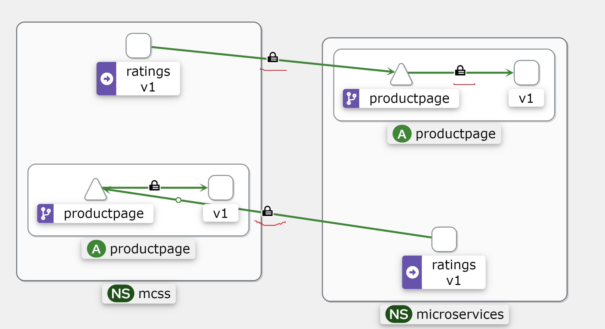
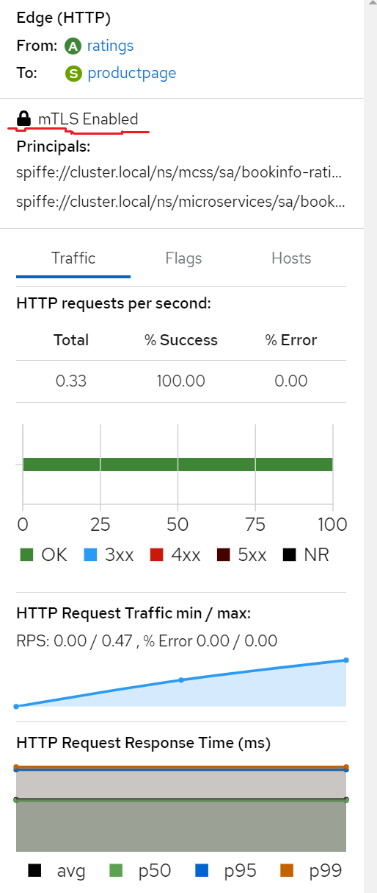

#### Install `metrics-server` which required at least for `HPA` and `Istio` too

```bash
$ helm repo add metrics-server https://kubernetes-sigs.github.io/metrics-server/
$ helm install metrics-server metrics-server/metrics-server -n kube-system
```

#### Install Istio with helm (To install `istioctl` use https://istio.io/latest/docs/setup/install/istioctl/) (Mniminum helm version: 3.8.2)
```bash
$ helm repo add istio https://istio-release.storage.googleapis.com/charts
$ helm repo update
$ helm install istio-base istio/base -n istio-system --set defaultRevision=default --create-namespace
$ helm install istiod istio/istiod -n istio-system --wait
$ istioctl analyze -n istio-system
```

#### We can install addons https://github.com/istio/istio/tree/master/samples/addons
```bash
$ kubectl apply -f istio/samples/addons/
```

#### Create namespaces and label them for the `envoy` sidecar to be installed then, deploy sample applications

```bash
$ for ns in "microservices" "mcss"; do kubectl create ns $ns; kubectl label namespace $ns istio-injection=enabled; kubectl apply -f istio/samples/bookinfo/platform/kube/bookinfo.yaml -n $ns; istioctl proxy-status -n $ns; done
$ kubectl exec "$(kubectl get pod -l app=ratings -o jsonpath='{.items[0].metadata.name}' -n microservices)" -n microservices -c ratings -- curl -sS productpage:9080/productpage | grep -o "<title>.*</title>"
```

#### We can force enable MTLS enccryption between services with the following syntax or by default it is enabled if in the front of the pod present `envoy` sidecar
```bash
kubectl apply -f - <<EOF
apiVersion: security.istio.io/v1beta1
kind: PeerAuthentication
metadata:
  name: default
  namespace: microservices
spec:
  mtls:
    mode: STRICT
EOF

kubectl apply -f - <<EOF
apiVersion: security.istio.io/v1beta1
kind: PeerAuthentication
metadata:
  name: default
  namespace: mcss
spec:
  mtls:
    mode: STRICT
EOF
```

### Generate traffic between services

```bash
$ microservices_ratings_pod=$(kubectl get pods -n microservices | grep ratings | awk '{ print $1 }')
$ mcss_ratings_pod=$(kubectl get pods -n mcss | grep ratings | awk '{ print $1 }')
$ for 1 in `seq 1000`; do kubectl exec -it $microservices_ratings_pod -n microservices -- curl productpage.mcss.svc.cluster.local:9080; done
$ for 1 in `seq 1000`; do kubectl exec -it $mcss_ratings_pod -n mcss -- curl productpage.microservices.svc.cluster.local:9080; done
```

#### To check encryption we can install Kiali and look at the web UI with the encryption Icon too

```bash
$ kubectl port-forward svc/kiali -n istio-system 20001:20001
```

#### Just look at the following screenshots which shows to us encryption between the services


